# RecPlot de Percolação em imagens de Displasia Oral e Câncer de Pulmão

---

## Objetivo

Avaliar o impacto do uso da representação por **Recurrence Plot (RP)** na classificação de imagens histológicas de displasia oral.

Foram comparados:

- Imagens originais;
- Imagens geradas por Recurrence Plot;
- Diferentes arquiteturas de CNN;
- Combinações em ensemble.

---

## Configuração Experimental

Foram avaliados:

- MobileNet_v2
- EfficientNet_b0

Representações:

- Imagem Original
- Recurrence Plot (RP)

Cada configuração foi executada utilizando 8 *seeds*, permitindo analisar não apenas a média das métricas, mas também sua estabilidade.

---

## Exemplos de Imagens

### Displasia

  
  

### Pulmão

  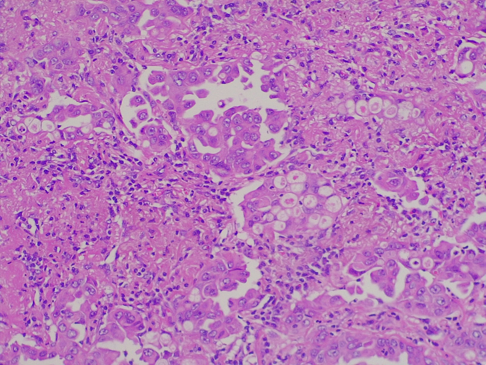
  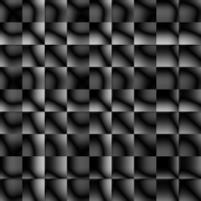

---

## Observações sobre o treinamento

* As redes apresentaram forte tendência ao overfitting durante o treinamento.
* A aplicação de data augmentation (apagamento aleatório de regiões e pequenas variações de brilho) piorou a qualidade das predições.
* O congelamento das camadas iniciais da EfficientNet e da MobileNet reduziu o overfitting e melhorou o desempenho dos modelos.
* A EfficientNet mostrou-se mais propensa ao overfitting do que a MobileNet, provavelmente devido à sua maior complexidade, o que dificulta o treinamento com um conjunto reduzido de imagens.

---

## Graficos! 
<h2 align="center">acc vs f1</h2>

  

    <b>Displasia</b> 
    
  

  

    <b>Pulmão</b> 
    
  

---

<h2 align="center">Boxplots</h2>

<b>Acurácia média e desvio padrão para Displasia.</b> 

<b>F1 Macro médio e desvio padrão para Pulmão.</b> 

---

## XAI
Para compreender quais regiões influenciaram as decisões das redes, foi utilizada a biblioteca **Captum**.

### Visão Geral

#### Displasia MobileNet

  

    <b>Saudável</b> 
    
  

  

    <b>Severe</b> 
    
  

#### Displasia EfficientNet

  

    <b>Saudável</b> 
    
  

  

    <b>Severe</b> 
    
  

#### Pulmão MobileNet

  

    <b>Aca</b> 
    
  

  

    <b>Nor</b> 
    
  

  

    <b>Scc</b> 
    
  

#### Pulmão EfficientNet

  

    <b>Aca</b> 
    
  

  

    <b>Nor</b> 
    
  

  

    <b>Scc</b> 
    
  

 

> Tradução:

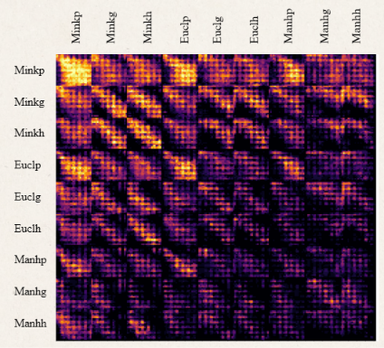

$P_k$ — Número médio de clusters:
Mede a quantidade média de agrupamentos (componentes conexos) formados em cada janela da imagem. Valores altos indicam uma textura mais fragmentada, enquanto valores baixos sugerem regiões mais contínuas e homogêneas.
$G_k$— Probabilidade de percolação:
Mede a fração de janelas que atingem o limiar crítico de percolação, indicando a formação de uma estrutura suficientemente conectada. Valores altos representam maior conectividade da textura, enquanto valores baixos indicam predominância de regiões fragmentadas.
$H_k$ — Tamanho médio do maior cluster:
Mede a proporção ocupada pelo maior agrupamento em cada janela. Valores elevados indicam a presença de grandes regiões conectadas, enquanto valores baixos refletem agrupamentos menores e mais dispersos.

### Visão em imagens específicas

#### Displasia: MobileNet × EfficientNet

<b>MobileNet</b>  
<b>Classe Saudável</b> 
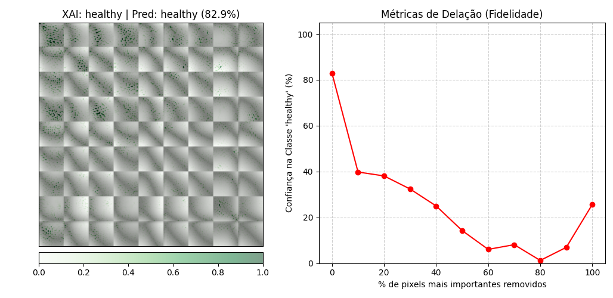

<b>EfficientNet</b>  
<b>Classe Saudável</b> 
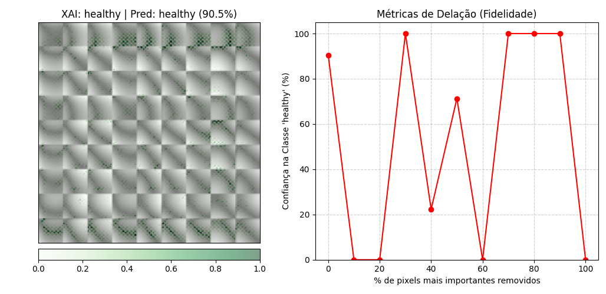

 

<b>Classe Severe</b> 
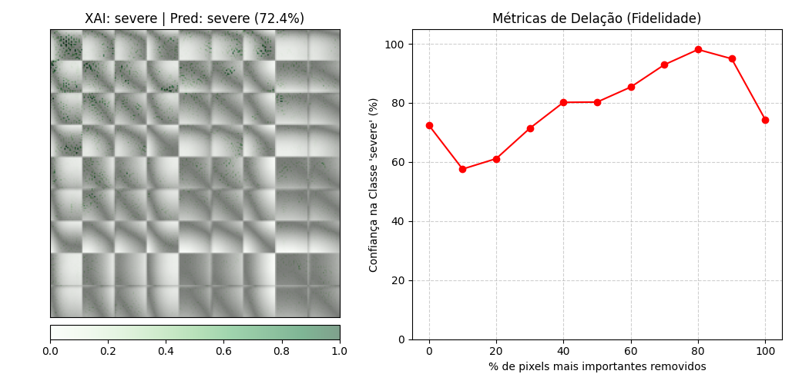

<b>Classe Severe</b> 
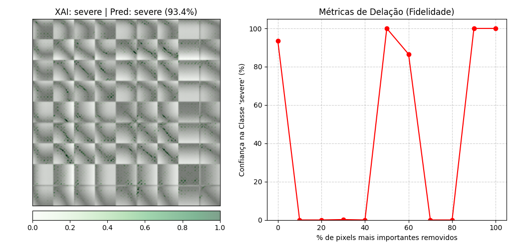

#### Pulmão: MobileNet × EfficientNet

<b>MobileNet</b>  
<b>Classe Acc</b> 
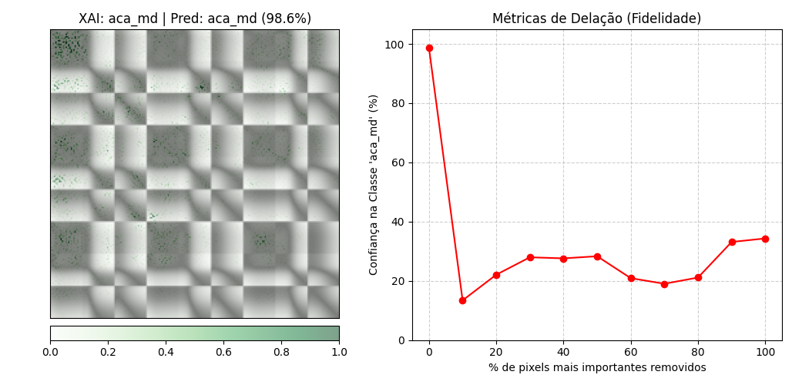

<b>EfficientNet</b>  
<b>Classe Acc</b> 
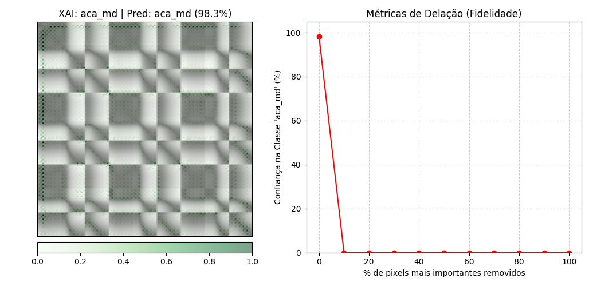

 

<b>Classe Nor</b> 
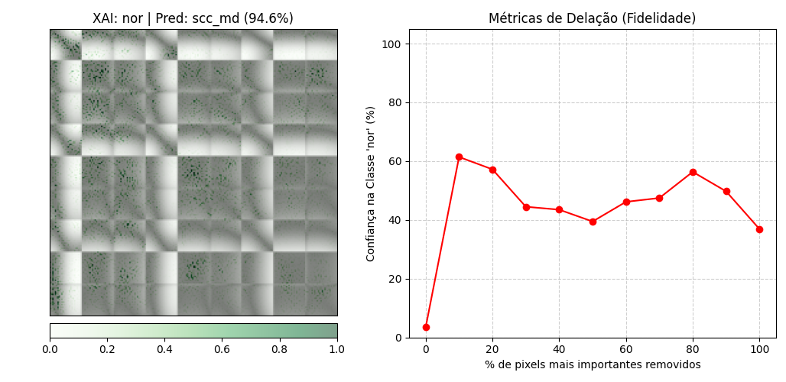

<b>Classe Nor</b> 
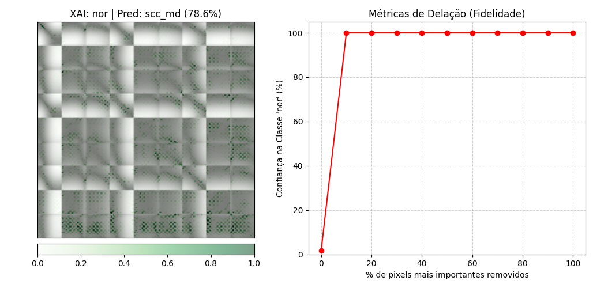

 

<b>Classe Scc</b> 
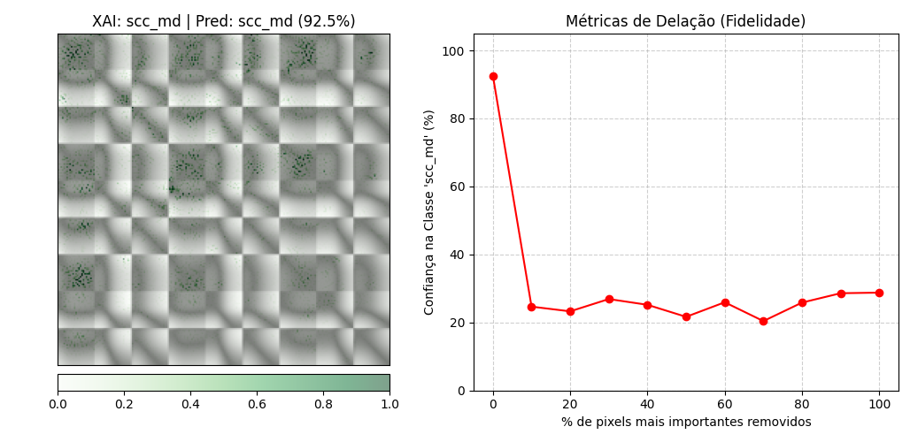

<b>Classe Scc</b> 
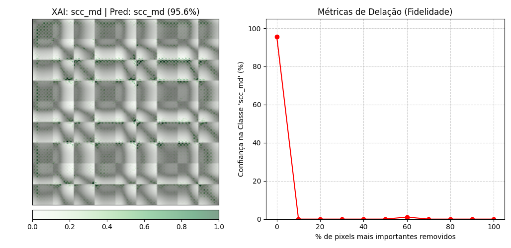

